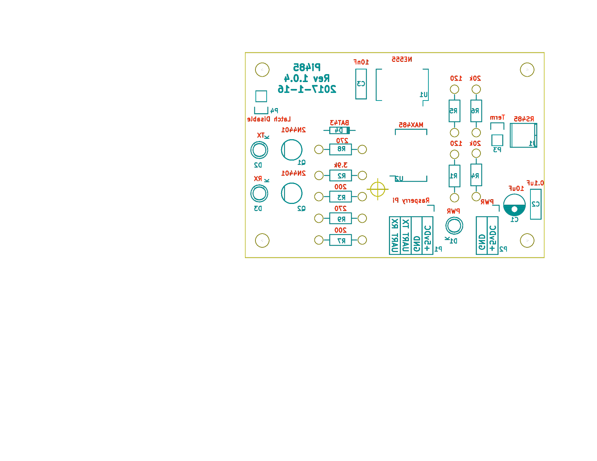

# Pi485 - UART TTL (Raspberry Pi / Arduino) to RS485
## What is it?

Pi485 lets you connect the RX / TX pins on your Raspberry Pi (/dev/ttyAMA0) or Arduino device to an RS-484 network, 
and transmit / receive as if the network were a normal serial device. 

## What can it do?

* Create a low-cost RS-485 network of devices using serial I/O.
* Communicate with other RS-485 networks.

Recent models of HVAC equipment (so called, "communicating" units) typically use RS-485 for the physical connection.
This makes deciphering the comms stream a software problem, and one that many people have already started working on!

## Schematic & PCB Layout

PCB Copper Side

PCB Component side (mirrored for iron transfer)

## What's in this repo?

This repository contains my kicad EDA source schematics, PCB layouts, and rendered PDF plots of both.
Oh, and there's documentation, too.

### Standalone
There is a standalone module you can assemble from discrete components. If you're going to make an order from your supplier of choice, I 
recommend this board. If you're going to be etching your own boards, this one is a good deal easier in it's current form to work with.

### Bearer
The bearer is a module designed to hold a slightly modified (unsolder the 120ohm termination resistor) LC Technologies (or equivalent) 
RS-485 board. These boards are based around a max485 in a surface-mount configuration, and include filtering capacitors, a power LED, and
some pull-up resistors. The bearer board adds the 555 latch circuit, jumpered termination, and power on/off control features from the
standalone module.

## Project Background

I've had a couple Raspberry Pi's laying about my home for a few years now. After running across the Infinitude project, I realized that my 
HVAC system (A Bryant unit) is actually a 'communicating' system as well. I've had in the back of my mind for some time a project to hook up
a raspberry pi, and track long-term time-series data on my HVAC unit, performance, and temperature differentials.

## Unique Features

All of the project variations in this repository feature the following:
* Termination Jumper. None of the commercial offerings or existing modules I've seen allow you to disable the termination resistor. On a 
multi-module RS-485 network, it's necessary that middle-nodes not have the termination resistor in the circuit, or the bus signals will 
deteriorate significantly.
* Latched DE / RE pins on the MAX485, with a 'latch disable' jumper. If you want to disable the DE latching (TX driven Driver mode) and 
force your device to be 'read only', you can add a jumper to the "Latch Disable" header, which will pull the 555 output to always be 'low'.
* Software controlable off / on. Using a GPIO pin (3.3v) you can turn the circuit 'on' or 'off', allowing for a software reset of the 485
bus, "power management", or enabling you to setup your UART tty before communications begin. If you prefer the 'always on' approach, you can simply hook up 
positive voltage to the control pin, and the circuit will always be on.

