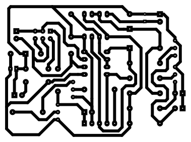
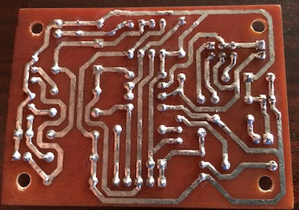
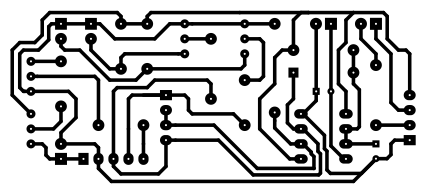
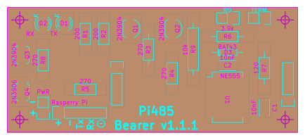
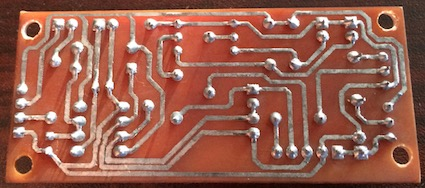
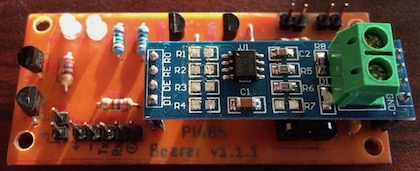

# Pi485 - UART TTL (Raspberry Pi / Arduino) to RS485
## What is it?
Pi485 lets you connect the RX / TX pins on your Raspberry Pi (/dev/ttyAMA0) or Arduino device to an RS-484 network, 
and transmit / receive as if the network were a normal serial device.

## What can it do?
* Create a low-cost RS-485 network of devices using serial I/O.
* Communicate with other RS-485 networks.

Recent models of HVAC equipment (so called, "communicating" units) typically use RS-485 for the physical connection.
This makes deciphering the comms stream a software problem, and one that many people have already started working on!

## Features
All of the project variations in this repository feature the following:

* Termination Jumper. None of the commercial offerings or existing modules I've seen allow you to disable the termination resistor. On a 
multi-module RS-485 network, it's necessary that middle-nodes not have the termination resistor in the circuit, or the bus signals will 
deteriorate significantly.
* Hardware Latched DE / RE pins on the MAX485 driven by TX activity, with a 'RO' (Read Only) jumper header.
Adding a jumper will force your device to be 'read only' by disabling the hardware latch of the DE / RE Pins.
* Software controlable off / on. Using a GPIO pin (3.3v) you can turn the circuit 'on' or 'off', allowing for a software reset of the 485 
module, pseudo "power management", or simply give you the time to setup your UART tty before initiating a communication connection.
If you prefer the 'always on' approach, you can simply hook up positive voltage to the control pin, and the circuit will always be on.

## What's in this repository?
This repository contains [KiCad EDA](http://kicad-pcb.org/) source schematics, PCB layouts, and rendered SVG plots.

The SVG Plots can be used to print your own PCB, or you could try using them as a template for making your own.

## What? Make my own PCB?
I've had good success with the layouts in this repo using the laser-printer hot-iron transfer method. I've gotten excellent results with 
Hammermill Color Laser Gloss (sku 163110) paper. It's a 32lb very smooth gloss paper like you'll find on lightweight magazine covers.
The 163110 takes and transfers toner very well, and is light enough for use in nearly every laser printer I've run across.
When soaked in water for a few minutes after ironing the paper easily peels off without removing the toner. I normally lightly sand the 
left-over transfer with 1500 grit paper to remove the last of the paper fibers and any gloss 'bleed' before chemical etching the board.

Now that I have my method down I could probably tweak the layouts to shrink the trace size (from 1.0 to 0.8 or 0.7) which would help with
some of the 'bleed' I sometimes get when doing the iron transfer.

I also have invested in some inexpensive carbide drill bit sets from 0.3 - 1.2mm for drilling the PCBs in a drill press.

If you're interested in a prebuilt board, contact me (bvarner) via github. I would be willing to coordinate a small run, and I may have a 
few boards on hand (or on ebay) you could convince me to part with.

## Usage
To setup a RaspberryPi so that you can use the UART for what you want rather than it exposing a serial console.

1. Use `raspi-config` to disable the serial console.
2. Enable the UART at boot by editing `/boot/config.txt` and setting `enable_uart=1`.
3. A pi485 requires a logic 'high' signal on the PWR (P1 connector, pin 5) signal line. You can wire up a +3.3v line to force power to always
be 'on', or you can control it with a GPIO pin.

If using a GPIO pin, a convenient way to manage this is to install `wiringpi`, and edit the `/etc/rc.local` script to add the following lines:
```
/usr/bin/gpio mode 1 out
/usr/bin/gpio write 1 1
```

You can also take the opportunity to set your tty settings in `/etc/rc.local` if you so desire.

## Hardware Configurations

### Standalone
This complete solution can be assembled from discrete components. It uses a Max485 IC, and NE555 timer, and some discrete components to 
implement a hardware level RS-485 interface that automatically controls the DE / RE pins based on TX activity, allows for jumper 
configuration of termination, and adds blinken-lights for TX / RX, and Power.

This configuration is the easiest one to fabricate at home. Everything from pad size, to trace width and clearance restrictions have been
tweaked to make this easier to work with for novices. Armed with a single-sided copper clad board, some ferric chloride, a fine-tipped 
sharpie marker and a steady hand, you could build this layout without doing an iron transfer. However, the component cost is higher. The
PDIP Max485 in small quantities is by itself more expensive than a single LC Technologies RS485 module used by the bearer configuration.

 

 

### Bearer
The bearer board is designed to hold an [LC Tech MAX485 module](http://www.chinalctech.com/index.php?_m=mod_product&_a=view&p_id=811), which
is an inexpensive module based around a max485 in a surface-mount, slew-rate limited configuration. 
These modules include some support components like power filtering capacitors, a power LED, and some pull-up resistors.
Building a bearer board is a bit more tricky, as it has lower clearance tolerances between traces, thinner traces, and requires that you 
modify (unsolder) some resistors off the LC Tech module. However, when full BOM part costs are taken into consideration, if you're making
more than one pi485, it'll be cheaper to use the bearer configuration.

 

 


The bearer board adds the 555 latch circuit for DE/RE control from the TX line, RX / TX LEDS, power on/off, and 
jumper termination control from the standalone board design (if you unsolder the 120Ohm resistor on the LC Tech module).

In my experience, if you want to make more than one of these devices, it's much cheaper to purchase the LC Tech modules and build Pi485 
bearer boards to hold them.

## Project Background
I've had a couple Raspberry Pi's laying about my home for a few years now. After running across the 
[Infinitude project](https://github.com/nebulous/infinitude), I realized that my 
HVAC system (a Bryant unit) is actually a 'communicating' system as well. I've had in the back of my mind for some time a project to hook up
a raspberry pi, and track long-term time-series data on my HVAC unit, performance, and temperature differentials.

### Off The Shelf Module Shortcomings / Circuit Analysis / Reasons this project exists.

Almost every module I've looked at is based on the [MAX485](http://datasheets.maximintegrated.com/en/ds/MAX1487-MAX491.pdf).

#### Overly simplistic opinionated view of RS-485.
It seems that off-the-shelf modules tend to approach the MAX485 series of half-duplex (two wire RS485) chips as a pretty simple TTL->485 
converter, suitable for locating at the _endpoints_ of a very simplistic single master-slave network. In order to drop in multiple modules 
(multiple slaves) or enable multi-master communications and form a true network, there's some hardware work that needs to be done (removing
termination resistors) and software control of the RE / DE with a GPIO (which open you up to a whole slew of software timing issues).

#### Soldered on Termination
For example, the LinkSprite module and the LC Tech modules both carry 120Ohm termination resistors, and no jumper header to remove it from
the circuit. The only practical option to add these modules as a network node other than an 'end point' is to unsolder that resistor.

#### Lack of TX / RX Visibility
I like [blinkenlights](https://en.wikipedia.org/wiki/Blinkenlights). These products should have blinkenlights.

#### DE / RE Pin Hysteresis 
Additionally, the LC Tech module has the DE and RE pins of the Max485 directly accessible over headers but provides no extra circuitry to 
drive the input to those pins based off the TTL TX. These two pins of a Max485 are responsible for setting the duplex state of the chip 
(Driver Enable / Receiver Enable) for either sending or receiving data. The RE pin is active on Logic Low (GND) and the DE pin is active on 
Logic High (~20ma of forward voltage). For this reason, you'll commonly see these pins wired together. When set High, the Max485 disables
receiving, and enables transmitting. When pulled low, it enables receiving and disables transmitting. The LC Tech module seems to defy all 
logic and reason in how it wires up the DI, DE, RE, and RO pins. Each pin has a 10k pull-up resistor. So unless you're actively draining 
these pins to ground with your logic circuits,  your max485 is going to end up in "write" mode by _default_. In a multi-master half-duplex
system like an HVAC unit (the initial target application for pi485) this causes a big problem.

I've found many schematics which suggest tying the DE / RE pins to a separate GPIO. This is a terrible idea in practice. In a busy RS485 bus
the time between the DI/DE pins shifting and the start of output on the TX pin would effectively guarantee a collision on the network.

I've also found schematics for RS-232 -> RS-485 converters which work by converting the 232 signal to TTL, then the TTL to RS-485. In these
circuits, they tend to leverage a 555 timer as a time-delayed latch, to hold the DE / RE pins in transmit mode based on the state of the TTL
TX pin. This seems like a really good idea in theory, and in circuit simulations (I don't have a physical scope) it appears that the 555
output will respond quickly enough for at least a 38400baud network to cleanly communicate all the necessary symbols over the wire (given 
the sizing of resistors and capacitors in use with the 555).

In this [555 TTL Latch Simulation](http://tinyurl.com/hx6gfwh), there's a +5V supply, GND, and a H/L logic input (clickable) on the left. 
The output pin of the 555 has a H/L output detector on it, and drives an NPN transistor to turn on an LED. In a real circuit using this 
technique, the 555 output pin would drive the DE/RE pins on a Max485. As an example, checkout the 
[AVT530](http://serwis.avt.pl/manuals/AVT530.pdf), an RS232 to RS485 converter that uses TTL as an intermediary. The schematic is on page 2.

The same company also uses this same 555 & Max485 circuit on their [USB to RS485](http://serwis.avt.pl/manuals/AVT530USB.pdf) converter.

The down-side with these circuits, is that there is a timing differential after the TX pin stops transmitting that the RE pin is held high.
Recall earlier I mentioned things about start / stop bits? This is where that comes into play.
At 38400Hz (as in the simulation above) this delay accounts for an entire clock cycle of bit transmission on the bus. In the interactive 
simulations above, note how if you switch the TTL input high (0 or idle) it takes 2 clocks before the 555 sets the output back low. If your
bit protocol doesn't include a stop bit (idle / high) then the DE / RE will not be disabled at the appropriate time. Without stop bits, you 
will transmit one extra idle (logical 1) on the 485 bus and miss receiving a bit for a clock with these latched circuits.

Here's another [simulation of the 555 latch circuit with pulsed input](http://tinyurl.com/hn6zreu). In this revision, we've added a pull-up
resistor (5k) to the input trigger to hold it 'high' when idle, moved the input clk to drive a decade counter, and tied output pins from the
counter to switch an NPN transistor that sinks the trigger pin low when the counter has a high output. Think of the counter as sending 
logical 1's and 0's by pushing a switch. When the switch (transistor) is closed, the TR voltage drops to ground. If you have start or stop
bits enabled in your stream, this initial drop (0) will be the start bit, which will trigger the 555 output high. In the AVT circuits, this 
drives the RE / DE pins high, putting the MAX485 into transmit mode. An idle 'high' stop bit (Q8) will let the timer's capacitor drain, 
resetting it's output pin. But if you're not using start / stop bits... and you're just getting a stream of bits that is synchronized 
in software, then using a 555 latch is going to be asking for trouble.

In looking at the LinkSprite module, I found it interesting that it dispenses with a time-delay latch and supplies power to the DE / RE pins
via MOSFETS switching a 0.33mA current based upon the TX input. This seems rather 'icky' to me, since logically I would think the DE / RE
pins going 'high' whenever the TTL signal goes idle, would cause an issue. So I threw together a 
[simulation of the TTL input with MOSFET](http://tinyurl.com/glnvxa2) triggers. This confirmed what I thought as far as behavior without 
delay. The good news here, is if you're sending a '0' on the RS-485 bus, you'll transmit that 0, and be prepared to receive any values from
the bus immediately afterward. So if your protocol doesn't use stop bits, you'll be able to read the stream without error. The natural
question at this point is, "what if I'm trying to transmit a '1' (logical TTL high / idle value)?" In that case, the DE pin would be pulled
low, along with the RE pin, putting the MAX485 into Driver disable, Receiver Enabled mode. I'm not sure if this would effectively pulse the
RS-485 bus in an appropriate manner. The Bus signals bits based on bias differences between the two wires, A and B. Something about this
arrangement smells funny.

According to the stuff I've read on RS-485, a driver 'idle' would be A+, B- potentials. After pouring over the Max485 datasheet, I don't see
anything that will lead me to believe RE high / DE low would result in A+, B- potentials being emitted on output lines of the chip.

Nevertheless, it must work... right? Unless the LinkSprite and LC Tech components aren't being tested in multi-master half-duplex 
networks. I have a feeling that's exactly what's going on, since they both carry soldered-on termination resistors that cannot be 
jumper-disabled. That means that if you introduced a network of these devices with more than two nodes, you'd have pretty significant signal
degradation.


