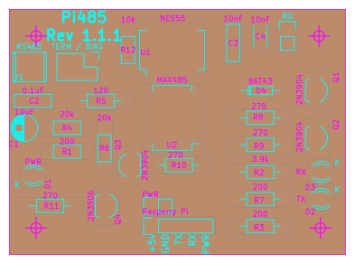

# Pi485 - UART TTL (Raspberry Pi / Arduino) to RS485
## What is it?
Pi485 lets you connect the RX / TX pins on your Raspberry Pi (/dev/ttyAMA0) or Arduino device to an RS-484 network, 
and transmit / receive as if the network were a normal serial device.

## What can it do?
* Create a low-cost RS-485 network of devices using serial I/O.
* Communicate with other RS-485 networks.

Recent models of HVAC equipment (so called, "communicating" units) typically use RS-485 for the physical connection.
This makes deciphering the comms stream a software problem, and one that many people have already started working on!

## Features
All of the project variations in this repository feature the following:

* Termination Jumper. None of the commercial offerings or existing modules I've seen allow you to disable the termination resistor. On a 
multi-module RS-485 network, it's necessary that middle-nodes not have the termination resistor in the circuit, or the bus signals will 
deteriorate significantly.
* Latched DE / RE pins on the MAX485 driven by TX activity, with a 'latch disable' jumper. If you want to disable the DE latching and 
force your device to be 'read only', you can add a jumper to the "Latch Disable" header, which will pull the 555 output to 'low'.
* Software controlable off / on. Using a GPIO pin (3.3v) you can turn the circuit 'on' or 'off', allowing for a software reset of the 485
bus, "power management", or enabling you to setup your UART tty before communications begin. If you prefer the 'always on' approach, 
you can simply hook up positive voltage to the control pin, and the circuit will always be on.

## What's in this repository?
This repository contains [KiCad EDA](http://kicad-pcb.org/) source schematics, PCB layouts, and rendered SVG plots.

The SVG Plots can be used to print your own PCB, or you could try using them as a template for making your own.

I recommend using a hot-iron transfer of a laser-printed printout on glossy paper as a good starting point. The PCB layouts in this repo 
have been tweaked to increase trace width, spacing, and pad sizes to help with this method, and to make it easier to touch up traces with
a resist pen if necessary. Personally, I don't have fancy CNC equipment at home, so I etch my boards chemically and drill them on a press.

### Standalone
 

This complete solution can be assembled from discrete components. It uses a Max485 IC, and NE555 timer, and some discrete components to 
implement a hardware level RS-485 interface that automatically controls the DE / RE pins based on TX activity, allows for jumper 
configuration of termination, and adds blinken-lights for TX / RX, and Power.

### Bearer
 

The bearer board is designed to hold an [LC Tech MAX485 module](http://www.chinalctech.com/index.php?_m=mod_product&_a=view&p_id=811), which
is an inexpensive module based around a max485 in a surface-mount, slew-rate limited configuration. 
These modules include some support components like power filtering capacitors, a power LED, and some pull-up / pull-down resistors.

The bearer board adds the 555 latch circuit for DE/RE control from the TX line, RX / TX LEDS, power on/off, and 
jumper termination control from the standalone board design (if you unsolder the 120Ohm resistor on the LC Tech module).

In my experience, if you want to make more than one of these devices, it's much cheaper to purchase the LC Tech modules and build Pi485 
bearer boards to hold them.

## Project Background
I've had a couple Raspberry Pi's laying about my home for a few years now. After running across the 
[Infinitude project](https://github.com/nebulous/infinitude), I realized that my 
HVAC system (a Bryant unit) is actually a 'communicating' system as well. I've had in the back of my mind for some time a project to hook up
a raspberry pi, and track long-term time-series data on my HVAC unit, performance, and temperature differentials.

