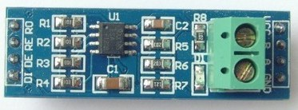
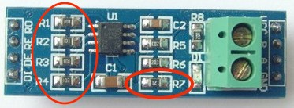

# Pi485 Bearer Module

Based upon what I learned while creating the Standalone pi485, this board is meant to function as a carrier / bearer for an
[LC Technologies RS485 module](http://www.chinalctech.com/index.php?_m=mod_product&_a=view&p_id=811), adding the RX / TX LEDs,
power controll, and latched DE / RE pin driving to this very inexpensive and commonly available module.

Unlike the standalone board this layout prioritizes compactness over ease of use for beginners.
The traces are thinner, clearances are tighter, and in order to get jumper-controlled termination, the 120Ohm surface mount resistor has 
to be removed from the 485 module.

This layout

 

will hold one of these

and addresses the shortcomings I uncovered while working on the standalone Pi485.

# Design Goals
* Add the functions and features of the standalone module in a more compact layout that can accomodate inexpensive LC Tech 485 modules.
* Latch the DE / RE pins on the Max485 based upon the UART TX activity, but allow that to be disabled (force read-only mode)
* Include jumper termination for the A/B lines of the RS485 bus.

For in-depth details on the function of [the circuit](plots/pi485bearer.png) refer to the [Standalone Module README](../standalone/README.MD).

# Build Instructions

1. Start off by customizing the resistor values for your LEDs. I used [http://ledcalc.com/] to help inspire my choices.
2. Use KiCad's PCB editor (pcbnew) to customize any footprint changes.
3. Print the [back copper](plots/pi485bearer-B.Cu.svg) layer on a laser printer, using glossy photo paper.
4. Print the [front](plots/pi485bearer-brd.svg) layers on a laser printer, using glossy photo paper.
5. Cut your board (62mm x 30mm)
6. Transfer the copper printout using a hot iron and some water.... (youtube reference coming). Touchup with a resist pen if necessary.
7. Etch the board.
8. Clean the board.
9. Tin the board.
10. Reflow the board (bake it in an oven).
11. Drill the component holes.
12. Place & solder components.
13. Assemble!
14. Remove the 120Ohm resistor (R7) from the LC Tech 485 Module.
    
