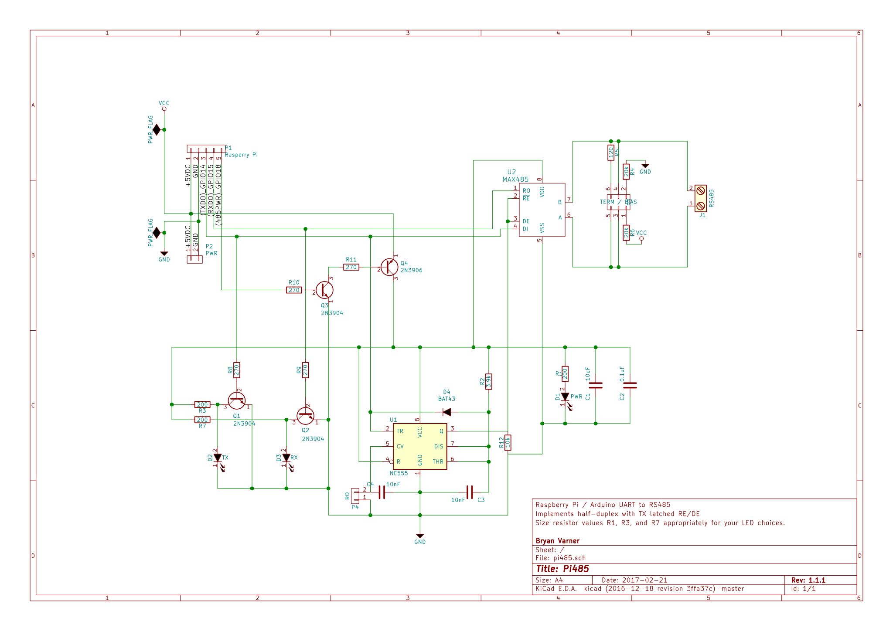

# Pi485 Standalone Module

This is a stand-alone module for RS-485 communication, utilizing a MAX485 IC and a NE555 Timer IC.
The PCB for this project is the most 'simple' of the two to etch yourself. Most of the pads are 
oversized, the copper traces are significantly wider and spaced far enough that it's possible 
to create a PCB with a resist marker by hand. 

## PCB Layout
 

## Schematic

# Design Goals
* [Simple / Easy To Understand Circuit](plots/pi485.png)
* Easily fabricated at home with simple tooling
* Reasonably inexpensive to source parts for and build (~$20 or less)
* Latch the DE / RE pins on the Max485 based upon the UART TX activity, but allow that to be disabled (force read-only mode)
* Include jumper termination for the A/B lines of the RS485 bus.

To achieve these goals the PCB layout in this repository is a single-side clad board, components on the front, copper on the back.
The traces are large (0.4mm!), the pads are oversized where possible, and I've allowed plenty of clearance between traces and pads, making
it possible to touch-up a hot-iron transfer with an ink-resist pen. You may even be able to draw the existing tracks with a pen free-hand.

For tooling, you'll need the 'standard' PCB etching supplies; a bottle of Ferric Chloride, some isopropyl alcohol, gloves, 
a dish to do the etching, and an appropriately sized drill bit. (I had a 0.040" bit in a set) I'd recommend you have a drill press, too.

I highly recommend doing a hot-iron transfer of laser printer toner. Print the SVGs using a laser printer onto glossy photo (or magazine)
paper. Heat the board with an iron, then stick the printout to the board. Press the printout firmly to the board using the hot iron (you're
goal is to melt the toner to the board surface), and then start soaking with water and continue steaming. Firm pressure and heat will do a
good job of sticking the printout onto the board. It works surprisingly well. Once you've steamed the paper (or soaked it in water) and it
starts to fall of the board, you can touchup any trace or pad issues with a resist pen, and etch the board.

I also use a kitchen oven to bake the board once it's tinned. Getting it up to ~425 degrees F does a nice job of reflowing the solder,
which makes it much easier to drill the holes.

# Circuit Analysis / Explanation

## TTL Serial Communication Basics
TTL signaling of serial data idles 'high'. When data is being transmitted on the TX pin, it first drops 'low' (a start bit), 
transmits it's data, and then sends a stop bit. In TTL, a logical 0 is GND. A Logical 1 is +V. But when there are no transmissions taking 
place, the pin holds 'high', at +V. I personally found [this SparkFun tutorial](https://www.sparkfun.com/tutorials/215) to be highly 
educational on the nuances of TTL. If your protocol doesn't include a start / stop bit, this can be problematic for converting TTL 
_transmissions_ to RS-485.

## Schematic Breakdown
The [current schematic](plots/pi485.png) is fairly straightforward.

All of the resistor values connected directly to LEDs should be double-checked for your LED selections.

## Power Input / Signal Connections
Starting in the upper left quadrant of the schematic, you have the input header pins (P1). There's a second pair of headers for an additional
+5vdc and ground connections (P2). I use the second two-pin header to connect my power supply, then connect the other pins to the Pi providing
power to the RaspberryPi and connecting the UART pins and 485PWR signal line.

## RX / TX LED Signaling
The RX & TX lines are tapped with 270ohm resistors to pull the 5vdc down to an appropriate level for tripping the NPN transistors in the 
lower left side of the schematic. When the voltage on the RX / TX pins goes LOW (signaling data, not idle), the NPN halts the flow of
 electricity from the Collector to the Emitter (opens the switch), leaving the only path to ground being through the LEDs. Make sure you 
 size your R3 and R7 resistors appropriately for your LEDs.

## Power Filtering, Switching, & Power LED 
Moving to the top-right portion of the schematic, there's another NPN controlling power flow from VCC to a few decoupling filter capacitors,
a power LED, and the positive supply voltage of the rest of the circuit. If you connect the 485PWR pin of P1 to a +3.3v header, you can make 
the circuit 'always on'. If you'd rather have 'control' over the circuit (for example, so you can setup the UART configuration and _then_ 
turn on the hardware) you can drive the 485PWR pin high with a standard GPIO pin.

## UART TX Connections
The TX line is connected to the trigger pin of a 555 timer, and then to the Data Input pin of the Max485.

The 555 timer circuit is a slightly modified missing pulse detector.

When the TX power drops below the threshold defined by the 3.9k resistor (R2), the output of the 555 goes HIGH. After a very short delay,
(it switches ~38400hz) the output will go back low, unless the the TX line input is still low. In a typical missing pulse detector, the 555
output will go back low regardless of the TX line (555 trigger) input. The addition of the shottky diode changes this configuration, and 
holds the output steady so long as the input is steady. The diode has to be capable of switching reverse voltage bias fast enough to keep
the input lower than the threshold / discharge output, but without affecting the input signal line. Hence the use of the BAT43, rather than
a 'normal' silicon diode.

The output of the 555 timer is used to set the input on the DE / RE (Driver Enable / Receiver Enable) pins on the max485. When HIGH, the 
Driver Enable is set, putting the Max485 into 'master' mode and broadcasting on the 485 bus. When LOW, the RE pin (which has inverted logic
on a Max485) is enabled, putting the Max485 into 'receive' mode.

If there is a jumper present on the CTRL pin (5) of the 555 timer, the 555 output will always be 'LOW' effectively holding the Max485 in 
Receive mode forever.

## UART RX Connection
Moving along the RX line, it's connected to the Data Output pin of the Max485.

## Max485 Output
The output pins of the Max485 are configured to setup a high-resistance reference against the current 'ground', and to allow the termination
(120 Ohm) resistor to be removed from the circuit.

## Putting it all together...
The circuit provides basic decoupling / power filtering, some passive LED monitoring of RX / TX lines, and a latch-based DE / RE driver 
logic for the Max485, along with a basic resistance network to setup the A/B differentials on the RS-485 bus.

# Analysis of other products / options
First off, I am not a professional. In reality I'm a software engineer who got into this out of curiosity. I have always detested 
black-boxes (things which I cannot take apart or understand completely) and it's my nature to dismantle, analyze, evaluate, and eventually 
take that knowlege and apply it to things I synthesize. But, I consider electronics a 'hobby'. My comments here are my own personal opinions
and are not an endorsement.

## Off The Shelf Module Shortcomings / Circuit Analysis

Almost every module I've looked at is based on the [MAX485](http://datasheets.maximintegrated.com/en/ds/MAX1487-MAX491.pdf).

It seems that off-the-shelf modules tend to approach the MAX485 series of half-duplex (two wire RS485) chips as a pretty simple TTL->485 
converter, suitable for locating at the _endpoints_ of a very simplistic master-slave network. In order to drop in multiple modules 
(multiple slaves) or enable multi-master communications and form a true network, there's some hardware work that needs to be done.

## Things I take issue with...
### Soldered on Termination
For example, the LinkSprite module and the LC Tech modules both carry 120Ohm termination resistors, and no jumper header to remove it from
the circuit. The only practical option to add these modules as a network node other than an 'end point' is to unsolder that resistor.

### DE / RE Pin Hysteresis
Additionally, the LC Tech module has the DE and RE pins of the Max485 directly accessible over headers but provides no extra circuitry to 
drive the input to those pins based off the TTL TX. These two pins of a Max485 are responsible for setting the duplex state of the chip 
(Driver Enable / Receiver Enable) for either sending or receiving data. The RE pin is active on Logic Low (GND) and the DE pin is active on 
Logic High (~20ma of forward voltage). For this reason, you'll commonly see these pins wired together. When set High, the Max485 disables
receiving, and enables transmitting. When pulled low, it enables receiving and disables transmitting.

I've found many schematics which suggest tying the DE / RE pins to a separate GPIO. This is a terrible idea in practice. In a busy RS485 bus
the time between the DI/DE pins shifting and the start of output on the TX pin would effectively guarantee a collision on the network.

I've also found schematics for RS-232 -> RS-485 converters which work by converting the 232 signal to TTL, then the TTL to RS-485. In these
circuits, they tend to leverage a 555 timer as a time-delayed latch, to hold the DE / RE pins in transmit mode based on the state of the TTL
TX pin. This seems like a really good idea in theory, and in circuit simulations (I don't have a physical scope) it appears that the 555
output will respond quickly enough for at least a 38400baud network to cleanly communicate all the necessary symbols over the wire (given 
the sizing of resistors and capacitors in use with the 555).

In this [555 TTL Latch Simulation](http://tinyurl.com/hx6gfwh), there's a +5V supply, GND, and a H/L logic input (clickable) on the left. 
The output pin of the 555 has a H/L output detector on it, and drives an NPN transistor to turn on an LED. In a real circuit using this 
technique, the 555 output pin would drive the DE/RE pins on a Max485. As an example, checkout the 
[AVT530](http://serwis.avt.pl/manuals/AVT530.pdf), an RS232 to RS485 converter that uses TTL as an intermediary. The schematic is on page 2.

The same company also uses this same 555 & Max485 circuit on their [USB to RS485](http://serwis.avt.pl/manuals/AVT530USB.pdf) converter.

The down-side with these circuits, is that there is a timing differential after the TX pin stops transmitting that the RE pin is held high.
Recall earlier I mentioned things about start / stop bits? This is where that comes into play.
At 38400Hz (as in the simulation above) this delay accounts for an entire clock cycle of bit transmission on the bus. In the interactive 
simulations above, note how if you switch the TTL input high (0 or idle) it takes 2 clocks before the 555 sets the output back low. If your
bit protocol doesn't include a stop bit (idle / high) then the DE / RE will not be disabled at the appropriate time. Without stop bits, you 
will transmit one extra idle (logical 1) on the 485 bus and miss receiving a bit for a clock with these latched circuits.

Here's another [simulation of the 555 latch circuit with pulsed input](http://tinyurl.com/hn6zreu). In this revision, we've added a pull-up
resistor (5k) to the input trigger to hold it 'high' when idle, moved the input clk to drive a decade counter, and tied output pins from the
counter to switch an NPN transistor that sinks the trigger pin low when the counter has a high output. Think of the counter as sending 
logical 1's and 0's by pushing a switch. When the switch (transistor) is closed, the TR voltage drops to ground. If you have start or stop
bits enabled in your stream, this initial drop (0) will be the start bit, which will trigger the 555 output high. In the AVT circuits, this 
drives the RE / DE pins high, putting the MAX485 into transmit mode. An idle 'high' stop bit (Q8) will let the timer's capacitor drain, 
resetting it's output pin. But if you're not using start / stop bits... and you're just getting a stream of bits that is synchronized 
in software, then using a 555 latch is going to be asking for trouble.

In looking at the LinkSprite module, I found it interesting that it dispenses with a time-delay latch and supplies power to the DE / RE pins
via MOSFETS switching a 0.33mA current based upon the TX input. This seems rather 'icky' to me, since logically I would think the DE / RE
pins going 'high' whenever the TTL signal goes idle, would cause an issue. So I threw together a 
[simulation of the TTL input with MOSFET](http://tinyurl.com/glnvxa2) triggers. This confirmed what I thought as far as behavior without 
delay. The good news here, is if you're sending a '0' on the RS-485 bus, you'll transmit that 0, and be prepared to receive any values from
the bus immediately afterward. So if your protocol doesn't use stop bits, you'll be able to read the stream without error. The natural
question at this point is, "what if I'm trying to transmit a '1' (logical TTL high / idle value)?" In that case, the DE pin would be pulled
low, along with the RE pin, putting the MAX485 into Driver disable, Receiver Enabled mode. I'm not sure if this would effectively pulse the
RS-485 bus in an appropriate manner. The Bus signals bits based on bias differences between the two wires, A and B. Something about this
arrangement smells funny.

According to the stuff I've read on RS-485, a driver 'idle' would be A+, B- potentials. After pouring over the Max485 datasheet, I don't see
anything that will lead me to believe RE high / DE low would result in A+, B- potentials being emitted on output lines of the chip.

Nevertheless, it must work... right? Unless the LinkSprite and LC Tech components aren't being tested in multi-master half-duplex 
networks. I have a feeling that's exactly what's going on, since they both carry soldered-on termination resistors that cannot be 
jumper-disabled. That means that if you introduced a network of these devices with more than two nodes, you'd have pretty significant signal
degradation.

# Build Instructions

1. Start off by customizing the resistor values for your LEDs. I used [http://ledcalc.com/] to help inspire my choices.
2. Use KiCad's PCB editor (pcbnew) to customize any footprint changes.
3. Print the [back copper](plots/pi485-B.Cu.svg) layer on a laser printer, using glossy photo paper.
4. Print the [front](plots/pi485-brd.svg) layers on a laser printer, using glossy photo paper.
5. Cut your board (70mm x 100mm)
6. Transfer the copper printout using a hot iron and some water.... (youtube reference coming). Touchup with a resist pen if necessary.
7. Etch the board.
8. Clean the board.
9. Tin the board.
10. Reflow the board (bake it in an oven).
11. Drill the component holes.
12. Place & solder components.
13. Assemble!
